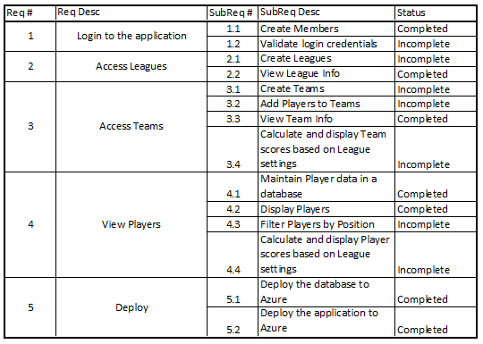
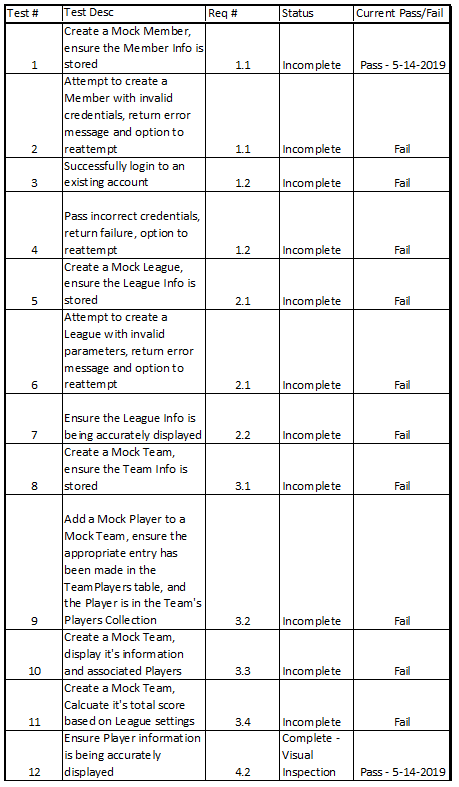

https://brassduck.azurewebsites.net/

# Brass Duck

This project is centered around hosting fantasy football leagues. As well as having a need for a custom application like this myself it is my central project for the Microsoft Software and Systems Academy Cloud Applications Developer Cohort. This project uses T-SQL and SQL Server Management Studio for database construction, C# and Visual Studio for the programming language and environment, and ASP.NET MVC Framework for the web application design format as well as several other associated technologies.

## Getting Started

If you want to run this application locally here is a brief description of how to get started.
This project took a database first approach so that is what I will describe here. 
First, create a database called BrassDuck. Then, download the [beginning data file](BrassDuckSampleData.xlsx). Use the SQL Server 2017 Import and Export tool to import the excel file to BrassDuck. Make sure to use whatever the name it has as it's name in the database as for the FROM clause in the INSERT INTO statement I have at the end of my script.
Then, execute [the setup script](BrassDuckSetupScript.txt) to create the tables, constraints and populate the Players table with data. Once the Solution is connected to your local database it should work fine.

## Requirements

### User Stories

As a fantasy football member
I need an application that will host my league
So that playing in the league is easier

As a fantasy football commissioner
I need an application that will host my league
So that maintaining and managing the league is easier

### Use Cases

#### Member
Create an account/Log in
Create/Edit a Team
Conduct player analysis
View their Team and other players’ Teams
Track Scores
View Results

#### Commissioner
Create an account/Log in
Create/Edit a League
Place the Players onto the appropriate Teams

## Design

### Data Model / Class Diagram

### Class Model

## Implementation

### Requirements Traceability Matrix

#### Prioritized Backlog Items

2.1;
3.1;
3.2;
4.3;
4.4;
3.4;
1.2;

## Testing

### Testing Plan

## Lessons Learned

### Be less busy. 
Too many things at once leads to the need to prioritize.
Burn out is real. 
### Be more independent
Guides are good, but they'll never be exactly what you want them to be.
Taking pieces of guidance from different sources makes it difficult to track the flow of the application.
### Be diligent in updating design documents
A better road map would've helped me focus and keep things in mind that I would need later.
